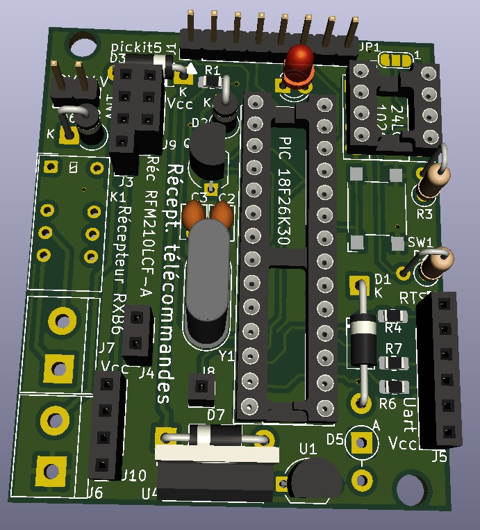

nice flor-s decoder for pic
===========================

Programme pic pour décoder le protocole des télécommandes Nice-florS.
Le projet est composé d'un PIC 18F26K80 à 16 MHz (x4 par pll = 64 MHz)
L'eprom interne contient le fichier ki.bin ainsi que les télécommandes apprises.
L'eprom externe de 128Ko contient le fichier codes.bin
Le platine électronique est faite en Kicad, répertoire "telecommande".
Le logiciel est fait avec MPLAB XIDE, repertoire "telecommande.X".
Utiliser la directive francais pour basculer en français pour le dialogues UART (230400 bauds par défaut)
Taper ? [enter] dans le terminal pour afficher le menu.

pic program to decode Nice-florS remote devices.
This project is made with a PIC 18F26K80 at 16 MHz (x4 with pll = 64 MHz)
Internal eprom contains the ki.bin file, and also learnt remotes.
External 128Kb eprom contains codes.bin file. 
The electronic board is made with Kicad, "telecommande" directory.
The software is made with MPLAB XIDE, "telecommande.X" directory.
Use english directive to switch to english UART dialogs (230400 bauds default).
Type in ? [enter] to display the menu.

The projet a été inspiré par :
This project was inspired from :
https://github.com/Jev1337/NiceFlor-Encoder

